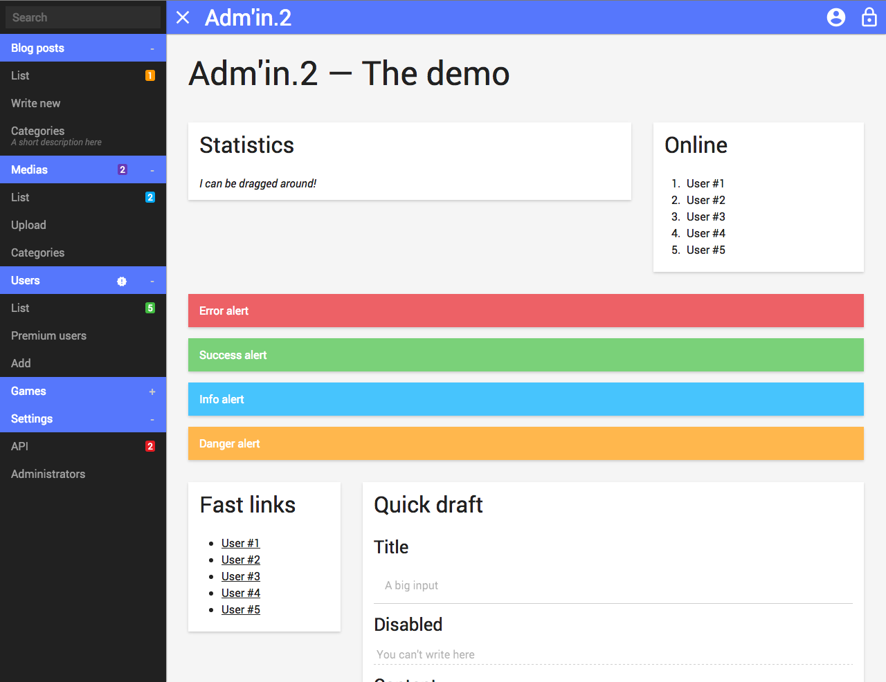

Adm'in.2
========

A simple — yet powerful — administration interface

Currently under development. All suggestions welcome!

## Demo or it didn't happen

There is a [live demo](https://comin2.github.io/Adm-in.2/demo/) on our Documentation website if you want to check it out.

## Docs and examples

The full documentation can be found [here](https://comin2.github.io/Adm-in.2/).

There is even [a tutorial to get you started](https://comin2.github.io/Adm-in.2/tutorial/).

If you are looking for the docs to use the plugins, take a look [around here](https://comin2.github.io/Adm-in.2/plugins/).

## Who uses Adm'in.2?

Please refer to the [dedicated documentation page](https://comin2.github.io/Adm-in.2/tutorial/users.html) for more information.

## Wanna talk about it?

Hit me up [on Twitter](https://twitter.com/viki53)!

## Need more?

Feel free to [open a new issue](https://github.com/comin2/Adm-in.2/issues) if you need something else.
